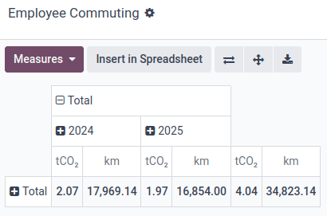
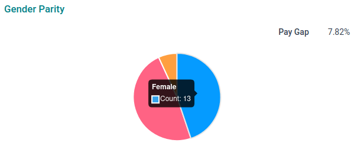

===
ESG
===

The ESG (Environment, Social, and Governance) app helps you automate ESG data collection by
integrating with apps like Accounting, Fleet, Payroll, and Employees.

Carbon footprint
================

The carbon footprint feature automates emissions tracking, providing real-time updates based on
purchases, expenses, and employee commuting for continuous monitoring and reporting.

Accounting
----------

The following accounting journal entries are covered:

- Vendor bills
- Vendor credit notes
- Expenses
- Salaries

By configuring the database, they can automatically be assigned an emission factor to collect
emissions.

.. admonition:: Main components of an emission factor

   **Emissions (kgCO₂e)**

   The app includes the six gases defined under the Kyoto Protocol: CO₂, CH₄, N₂O, HFCs, PFCs, and
   SF₆. Each gas is assigned a Global Warming Potential (GWP) value, allowing for conversion into a
   standard unit — CO₂-equivalents (kgCO₂e). This ensures consistency and comparability across
   different emission sources, aligning with the `GHG Protocol's standards
   <https://ghgprotocol.org/standards>`_.

   **Source**

   As required by the `GHG Protocol's standards <https://ghgprotocol.org/standards>`_ and others,
   sources are grouped into three scopes based on their origin:

   - Scope 1: direct emissions from owned or controlled sources (e.g., fuel used in company cars
     or on-site combustion),
   - Scope 2: indirect emissions from purchased energy (e.g., electricity or heating),
   - Scope 3: all other indirect emissions from the value chain, including both upstream (e.g.,
     supplier emissions or travel) and downstream (e.g., product use or waste).

   **Uncertainty**

   The uncertainty percentage is used to factor in the uncertainty arising from the way the emission
   factor was determined, as well as from the number and accuracy of the parameters involved in its
   calculation.

   **Compute Method**

   The compute method determines if emissions are calculated based on physical quantities (e.g.,
   kilograms of CO2 per kWh of energy used) or monetary values (e.g., emissions based on the cost of
   purchased goods).

.. note::
   Salaries are automatically assigned the *Zero Emission* emission factor.

Source database
~~~~~~~~~~~~~~~

Import the data from a certified emission factors database by going to :menuselection:`ESG -->
Configuration --> Source Databases`. Click :guilabel:`Download` on the `ADEME
<https://www.ademe.fr/en/our-missions/data>`_ database to import its emission factors and sources.

.. note::
   Create emissions manually by clicking :guilabel:`New` under the :guilabel:`Collect Emissions`
   card on the ESG dashboard.

Assignation rules
~~~~~~~~~~~~~~~~~

To collect emissions automatically, it is necessary to define assignation rules on emissions
factors.

To do so, go to :menuselection:`ESG --> Configuration --> Emission Factors` and select an emission
factor. Under the :guilabel:`Assignations` tab, click :guilabel:`Add a line`, and select a record
for one or more of the following attributes: :guilabel:`Product`, :guilabel:`Partner`, and
:guilabel:`Account`.

All attributes have to match for the rule to be applied.

.. important::
   Ensure the unit of measure set next to the product's :guilabel:`Cost` matches the emission
   factor's :guilabel:`Unit of Measure`.

   .. image:: esg/product-unit-of-measure.png
      :alt: A product's unit of measure

   If the field is not displayed, go to :menuselection:`Accounting --> Configuration --> Settings`
   and enabling the :guilabel:`Units of Measure & Packagings` option.

.. tip::
   Assign an emission factor to all relevant posted journal entries by selecting one, clicking
   :guilabel:`Assign`, selecting an :guilabel:`Application Period`, and, if desired, enable the
   :guilabel:`Replace existing assignations` option.

Priority
********

If multiple rules could be assigned (i.e., all the attributes of the rule match), Odoo prioritizes
the rule containing the **most precise attribute**, if any, using this hierarchy:

#. Product
#. Partner
#. Account

.. example::
   Given the assignation rules below, all products purchased from **Digital Den** will be assigned
   emission factor **#2**, except the **Zenith Pro Computer** product, which will be assigned
   emission factor **#1**.

   *Emission factor #1 assignation rule*

   .. list-table::
      :header-rows: 1

      * - Account
        - Partner
        - Product
      * - *Any Account*
        - *Any Partner*
        - **Zenith Pro Computer**

   *Emission factor #2 assignation rule*

   .. list-table::
      :header-rows: 1

      * - Account
        - Partner
        - Product
      * - *Any Account*
        - **Digital Den**
        - *Any Product*

If the attributes' precision cannot be used, Odoo prioritizes next the rule with the **most
attributes**.

.. example::
   Given the assignation rules below, any purchased **Zenith Pro Computer** will be assigned
   emission factor **#1**, except if purchased from the **Digital Den**, which will be assigned
   emission factor **#2**.

   *Emission factor #1 assignation rule*

   .. list-table::
      :header-rows: 1

      * - Account
        - Partner
        - Product
      * - *Any Account*
        - *Any Partner*
        - **Zenith Pro Computer**

   *Emission factor #2 assignation rule*

   .. list-table::
      :header-rows: 1

      * - Account
        - Partner
        - Product
      * - *Any Account*
        - **Digital Den**
        - **Zenith Pro Computer**

.. tip::
   Accounting journal entries with a missing emission factor can be found by clicking
   :guilabel:`Emissions to define` under the :guilabel:`Collect Emissions` card on the dashboard.

Fleet
-----

To collect CO₂ emissions generated by employees commuting with Fleet vehicles, the following
configuration is necessary:

- Set the emissions of each vehicle model by going to :menuselection:`Fleet --> Configuration -->
  Models`, selecting a model, and entering its :guilabel:`CO₂ Emissions`.
- Set each employee's home-to-work distance by opening the :guilabel:`Employees` app, selecting an
  employee, and filling in the employee's :guilabel:`Home-Work Distance`.
- Define the average number of days per week the employees commute to the office by going to
  :menuselection:`ESG --> Configuration --> Settings` and filling in the :guilabel:`Weekly Office
  Attendance`.

.. note::
   The employee vehicle's :guilabel:`Start Date` and, if applicable, :guilabel:`End Date`, are used
   to calculate the emissions. Ensure they are set by opening the :guilabel:`Employees` app,
   selecting an employee, and clicking the :guilabel:`Cars` smart button.

To access the employee commuting emissions pivot table, go to :menuselection:`ESG --> Collect -->
Employee Commuting`.

Social metrics
==============

To view a company's gender parity graph, set the gender of each employee by opening the
:guilabel:`Employees` app and selecting an employee. Under the :guilabel:`Private Information` tab,
select the employee's :guilabel:`Gender`.

.. note::
   The median gender pay gap is calculated using the :guilabel:`Wages` set on each employee's
   Payroll contract. The following formula is used to calculate it:

   (`median gross hourly pay of male employees` – `median gross hourly pay of female employees`) /
   `median gross hourly pay of male employees` × `100`
